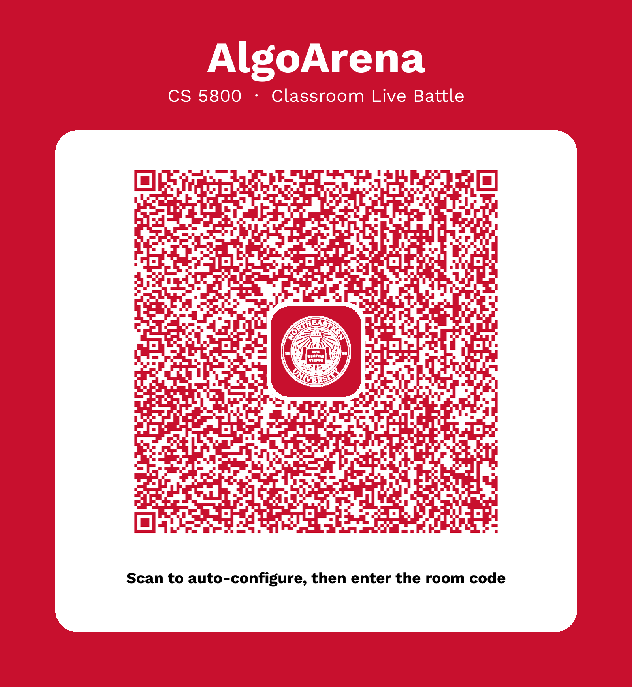

# AlgoArena

AlgoArena — an open-sourced Kahoot-style classroom quiz game for CS 5800 Algorithms MERGED, based on Dr. Maryam Farahmand's course materials and recommended CLRS textbook.

**Live demo:** https://yikangliu823.github.io/algoarena/

## Features

- **252 questions** covering the full CS 5800 syllabus (CLRS Chapters 2–5, 6–9, 15–16, 22–24, 25–33, 34), worded in the style of *Introduction to Algorithms* (3rd edition)
- **Question types**: complexity analysis, loop-count, proof-based, recurrence, definition, and algorithm-behavior questions
- **Difficulty mix**: 50 easy / 158 medium / 44 hard, including 40 proof-style and 23 loop-counting questions
- **Three play modes**
  - *Solo* — speed-based scoring (500–1000 per question) with streak bonuses
  - *Local versus* — two players on one screen; buzz in, 15 seconds to answer, wrong answers let the opponent steal at half points
  - *Live multiplayer* — powered by Firebase Realtime Database: the host creates a 4-character room code on the big screen, students join from their phones, fastest buzz wins (server-timestamped), answers are revealed only at the reveal stage to prevent cheating
- **Missed-question retry**, **streak scoring**, **custom question banks** (paste JSON, saved in the browser), and **in-game question reporting**
- **Single self-contained HTML file** — vanilla JavaScript, inline CSS, no build step, no dependencies beyond the Firebase CDN (live mode only)

## Quick start

**Play it live: https://yikangliu823.github.io/algoarena/** — no installation, no build, no server. It also runs by opening `index.html` in any modern browser.

Live multiplayer needs a free Firebase project (Spark plan, no credit card required) — the step-by-step setup is in the game's setup panel. The host then shares an invite link or reads out the room code; students join from their portable devices.

## Classroom invite QR

Students scan this code in class — it opens the game and auto-fills the Firebase config, then they just type in the room code shown on the big screen.



## Custom question banks

Paste a JSON array into the custom-bank field on the setup screen. Each item needs:

```json
{
  "module": "Module 1 · Foundations",
  "chapter": "Chapter 2",
  "difficulty": "medium",
  "qtype": "complexity",
  "question": "The running time of MERGE-SORT on n elements is…",
  "choices": ["Θ(n)", "Θ(n log n)", "Θ(n^2)", "Θ(n^2 log n)"],
  "answer": 1,
  "explanation": "…"
}
```

`answer` is the 0-based index of the correct choice.

## Project info

- **Author:** Yikang (Richard) Liu, M.S. Candidate in Computer Science, Khoury College of Computer Sciences, Northeastern University
- **Version:** 1.0
- **Created:** September 26, 2026 · San Francisco, California, USA

## License

This project is licensed under the MIT License — see [LICENSE](LICENSE.md) for details.

**Copyright © 2026 Yikang (Richard) Liu.**
